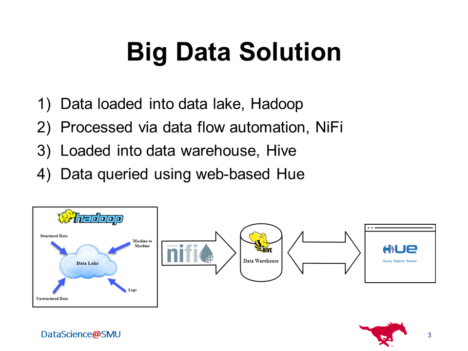
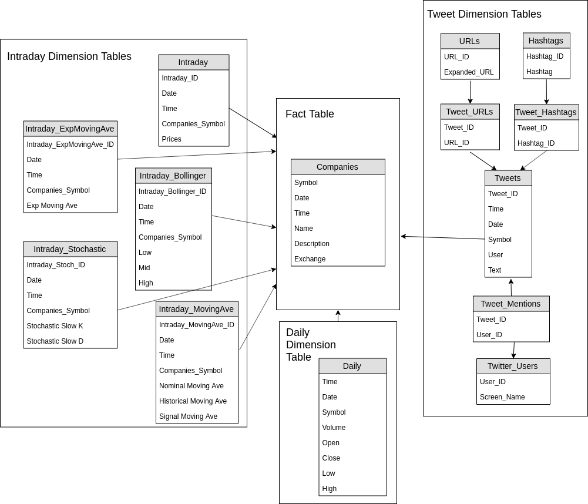
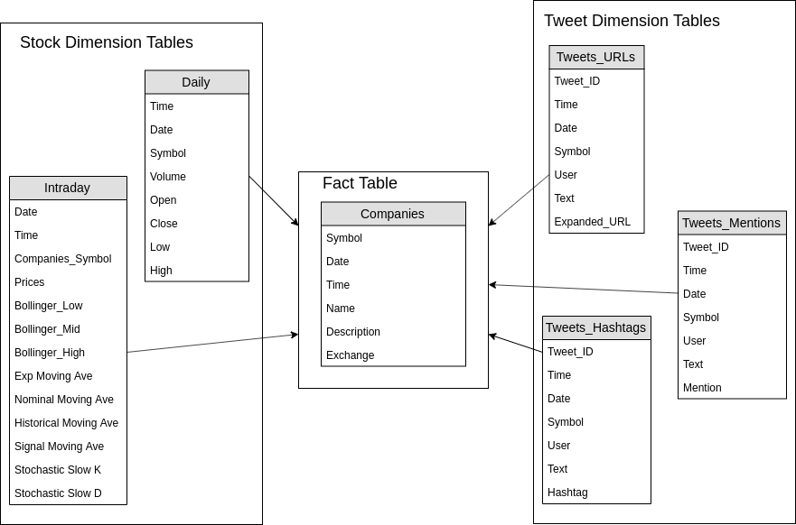
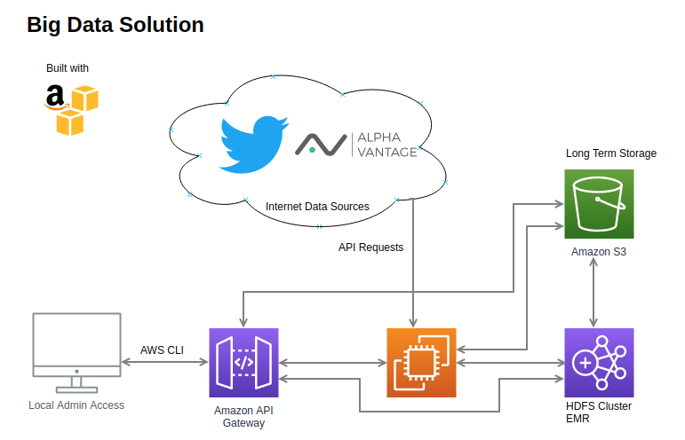
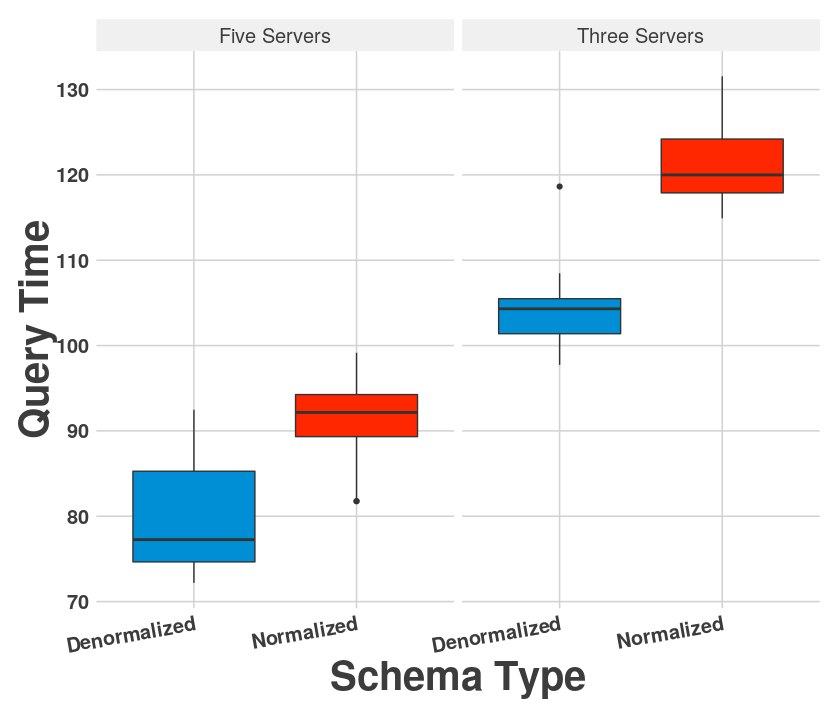

# Big Data Lake Solution for Warehousing Stock Data and Tweet Data

Created by [Stuart Miller](https://github.com/sjmiller8182), [Paul Adams](https://github.com/PaulAdams4361), and [Rikel Djoko](https://github.com/leriky).

**Table of Contents**

* [Problem Statement](#problem-statement)
* [Overview of the Big Data Solution](#overview-of-the-big-data-solution)
* [Data Warehouse Overview](#data-warehouse-overview)
  * [Snowflake Schema](#snowflake-schema)
  * [Denormalized Star Schema](#denormalized-star-schema)
* [Big Data Solution Implementation](#big-data-solution-implementation)
* [Results](#results)
* [Reports](#reports)

## Problem Statement

We want to build a large-scale data framework that will enable us to store and analyze financial market data as well as drive future predictions for investment.

For this project, we will use the following types of data.

* Daily stock prices for all companies traded on the NYSE and the NASDAQ.
* Intra-day values for all companies traded on the NYSE and the NASDAQ.
  * Prices: high, low, open, close,
  * Supporting Values: Brollinger Bands, stochastic oscillators, and moving average CD
  * Intra-day values are at 15 minute intervals
* Tweets from over [100 investment related twitter accounts](./scrape_utils/python/twitter_handles.txt)

## Overview of the Big Data Solution

## Data Warehouse Overview

Two star schemas were designed for this data warehouse: a fully normalized schema and a denormalized schema.
We will investigate the performance of the two schemas in the context of this problem.
Conceptual diagrams of the data warehouse schemas are shown below.

More detailed schema diagrams were created with MySQL WorkBench the schema design can be accessed [here](./reports/support/schemas).

### Snowflake Schema

A diagram of the dataware house snowflake schema is shown below. 

### Denormalized Star Schema

A diagram of the dataware house star schema is shown below. 

## Big Data Solution Implementation

The big data solution is build on AWS.

## Results

Queries were run on the two schemas with different EMR cluster sizes to see the impact of normalization on query time.
The collected data is located [here](./results_analysis/results.csv).
A plot summarizing the results is shown below.

## Reports

These reports were created during the course of this project.

* [Project Proposal](./reports/Proposal.pdf): Initial proposal regarding the problem and the proposed solution for investigation.
* [Initial Project Presentation](./reports/Initial_Presentation.pdf): A high level overview of the project idea and current status.
* [Final Project Presentation](./reports/Final_Presentation.pdf): A presentation describing the project goals, findings, and conclusions.
* [Project Paper](./reports/Project_Paper.pdf): A paper describing the project.
