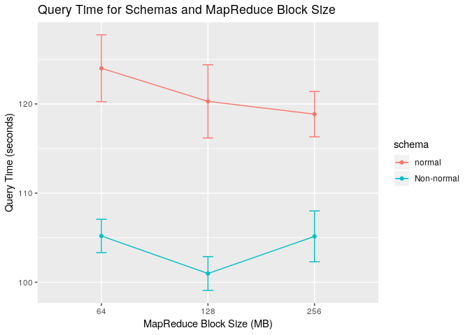
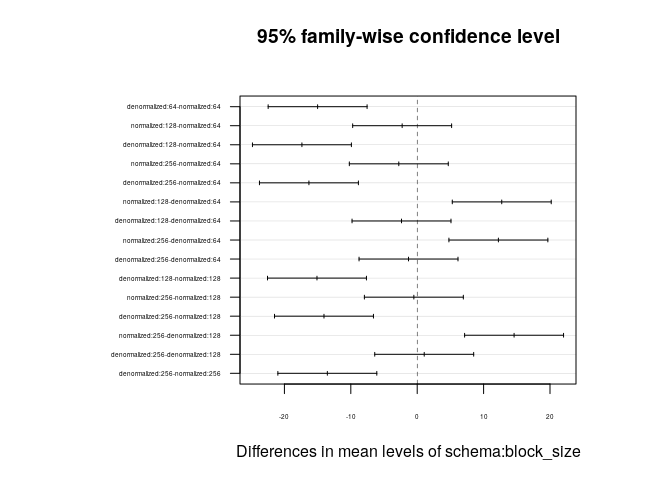

Analysis
================
Stuart Miller, Paul Adams, Rikel Djoko

# Power Analysis

The power analysis for this project was done using R package (pwr2).

<https://cran.r-project.org/web/packages/pwr2/pwr2.pdf>

``` r
pwr.2way(a=2, b=3, alpha=0.05, size.A=30, size.B=30, f.A=NULL, f.B=NULL,
delta.A=4, delta.B=2, sigma.A=2, sigma.B=2)
```

    ## 
    ##      Balanced two-way analysis of variance power calculation 
    ## 
    ##               a = 2
    ##               b = 3
    ##             n.A = 30
    ##             n.B = 30
    ##       sig.level = 0.05
    ##         power.A = 1
    ##         power.B = 0.99909
    ##           power = 0.99909
    ## 
    ## NOTE: power is the minimum power among two factors

# Results of Study

## Summary Stats for the Levels

This is assuming that schema is the main driving factor of variation.

    ## # A tibble: 12 x 7
    ## # Groups:   server_num, schema [?]
    ##    server_num  schema   block_size mean_time median_time IQR_time variance
    ##    <fct>       <fct>    <fct>          <dbl>       <dbl>    <dbl>    <dbl>
    ##  1 three_nodes normali… 64             124.        124.      5.04    14.1 
    ##  2 three_nodes normali… 128            120.        119.      5.17    16.9 
    ##  3 three_nodes normali… 256            119.        118.      2.58     6.50
    ##  4 three_nodes denorma… 64             105.        105.      2.14     3.50
    ##  5 three_nodes denorma… 128            101.        101.      2.31     3.60
    ##  6 three_nodes denorma… 256            105.        105.      1.11     8.13
    ##  7 five_nodes  normali… 64              91.9        92.4     2.81    11.5 
    ##  8 five_nodes  normali… 128             91.1        91.0     5.25    18.1 
    ##  9 five_nodes  normali… 256             91.5        92.3     5.34    19.3 
    ## 10 five_nodes  denorma… 64              80.7        81.2    10.3     37.0 
    ## 11 five_nodes  denorma… 128             80.2        78.8    10.9     34.4 
    ## 12 five_nodes  denorma… 256             78.1        75.8     4.36    30.1

## 2-Way ANOVA Profile Plot

``` r
ggplot(data = grouped, aes(y = mean_time, x = block_size, color = schema)) +
  geom_point() +
  geom_errorbar(aes(ymin = mean_time - sqrt(variance), ymax = mean_time + sqrt(variance)), width = .1) +
  facet_grid( ~ server_num) + 
  xlab('HDFS Block Size (MB)') +
  ylab('Query Time (seconds)') +
  ggtitle('Query Time for Schemas, MapReduce Block Size, and Cluster Size')
```

<!-- -->

## 2-Way ANOVA Profile Plot

Profile plot is colored by
    schema.

<!-- -->

    ##         schema block_size  N      Mean       SD        SE    Min     Max
    ## 1   normalized         64 60 107.95063 16.57147 0.2761911 82.274 131.555
    ## 2 denormalized         64 60  92.95123 13.12597 0.2187662 72.634 108.475
    ## 3   normalized        128 60 105.68287 15.30589 0.2550981 81.769 131.409
    ## 4 denormalized        128 60  90.58687 11.33662 0.1889436 72.196 105.065
    ## 5   normalized        256 60 105.17747 14.24803 0.2374671 81.762 126.534
    ## 6 denormalized        256 60  91.64200 14.29231 0.2382052 72.283 118.638
    ##        IQR
    ## 1 31.82175
    ## 2 24.09900
    ## 3 28.29100
    ## 4 21.97575
    ## 5 25.82625
    ## 6 29.34050

## Fit the ANOVA on the Data

This assumes data replication with schema as the primary source of
variation.

    ## 
    ## Error: block_size
    ##           Df Sum Sq Mean Sq F value Pr(>F)
    ## Residuals  2  384.2   192.1               
    ## 
    ## Error: block_size:schema
    ##           Df Sum Sq Mean Sq F value Pr(>F)   
    ## schema     1  19037   19037   829.9 0.0012 **
    ## Residuals  2     46      23                  
    ## ---
    ## Signif. codes:  0 '***' 0.001 '**' 0.01 '*' 0.05 '.' 0.1 ' ' 1
    ## 
    ## Error: Within
    ##            Df Sum Sq Mean Sq F value Pr(>F)
    ## Residuals 354  71801   202.8

## Plot Multiple Comparisons

<!-- -->
